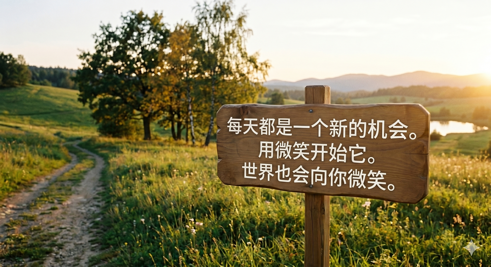
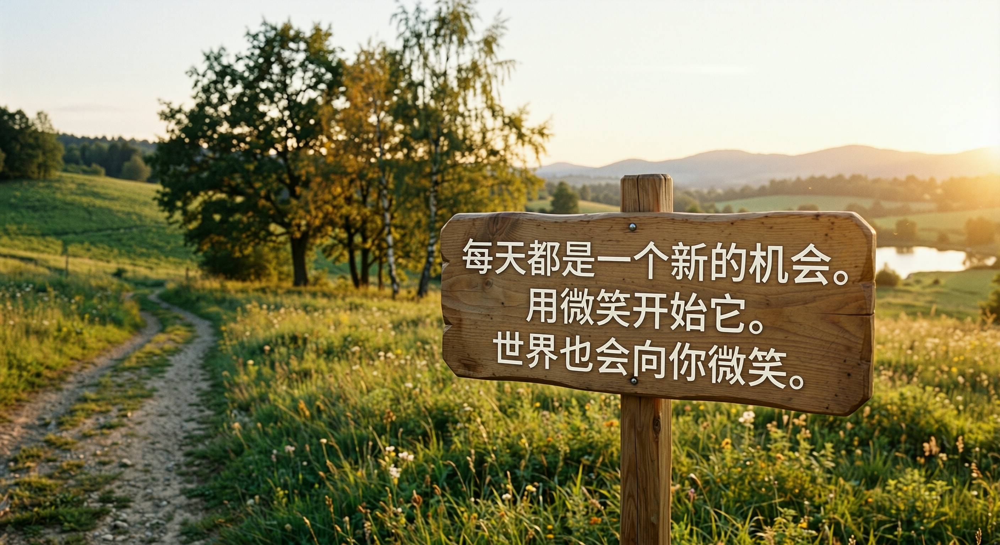

# Remove AI Watermarks

Remove AI provenance marks from images you generated yourself:

- known visible labels such as the Gemini sparkle and vendor text marks;
- invisible pixel watermarks through diffusion regeneration;
- C2PA, EXIF, XMP, IPTC, and related AI metadata.

> Try it online at [raiw.cc](https://raiw.cc) if you do not want to install Python
> or run diffusion models locally.

[](https://pypi.org/project/remove-ai-watermarks/)
[](https://pypi.org/project/remove-ai-watermarks/)
[](https://pepy.tech/project/remove-ai-watermarks)
[](LICENSE)
[](https://github.com/wiltodelta/remove-ai-watermarks/actions/workflows/test.yml)
[](https://github.com/sponsors/wiltodelta)

> This project is for lawful use on content you own. It does not target stock
> agency previews or other watermarks that protect third party paid content.
> See [scope, safety, and legal notes](docs/legal-and-safety.md).

## Choose what you want to do

| Goal | Command | GPU |
| --- | --- | --- |
| Find provenance signals and watermarks | `identify` | No |
| Remove known visible AI marks | `visible` | No |
| Erase a region you select | `erase` | No |
| Strip AI metadata | `metadata` | No |
| Regenerate an image to disrupt invisible watermarks | `invisible` | Recommended |
| Run visible, invisible, and metadata removal | `all` | Recommended |
| Process a directory | `batch` | Depends on mode |

## Installation modes

| Need | Install |
| --- | --- |
| Metadata inspection and stripping | `remove-ai-watermarks` |
| Visible detection and removal | `remove-ai-watermarks[visible]` |
| Torch-free DWT-DCT detection | `remove-ai-watermarks[detect]` |
| Diffusion removal | `remove-ai-watermarks[diffusion]` |
| Every production feature | `remove-ai-watermarks[all]` |

Lower-level and specialized extras include `pixels`, `heif`, `trustmark`,
`migan`, `lama`, `esrgan`, and `qwen-zimage`. The
[installation guide](docs/installation.md#feature-extras) documents their exact
dependency composition and model requirements.

## Quick start

Install the metadata-focused default CLI:

```bash
uv tool install remove-ai-watermarks
```

Inspect an image:

```bash
remove-ai-watermarks identify image.png
```

For visible watermark removal, install the pixel dependencies:

```bash
uv tool install --force "remove-ai-watermarks[visible]"
```

Then remove a known visible mark and AI metadata:

```bash
remove-ai-watermarks visible image.png -o clean.png
```

Strip metadata without running visible inpainting or diffusion:

```bash
remove-ai-watermarks metadata image.png --remove -o clean.png
```

For invisible watermark removal, install the diffusion dependencies:

```bash
uv tool install --force "remove-ai-watermarks[diffusion]"
remove-ai-watermarks invisible image.png -o clean.png
```

If the local detectors cannot confirm an invisible watermark but you know the
image came from an AI generator, add `--force`:

```bash
remove-ai-watermarks invisible image.png -o clean.png --force
```

See the [installation guide](docs/installation.md) for Homebrew, uv, optional
features, and development setup.

## Examples

### Visible Gemini mark

| Before | After |
| --- | --- |
|  |  |

### High quality invisible removal

The `qwen-zimage` profile is the highest fidelity option for face heavy images.
It is CUDA only and uses a much larger model stack than the default ControlNet
profile.

```bash
uv tool install --force "remove-ai-watermarks[qwen-zimage]"
remove-ai-watermarks invisible image.png -o clean.png \
  --pipeline qwen-zimage --force
```

| OpenAI example before | OpenAI example after |
| --- | --- |
| [](data/synthid/originals/ChatGPT%20Image%20May%2030,%202026,%2010_31_08%20AM.png) | [](docs/images/qwen-zimage/ChatGPT/ChatGPT%20Image%20May%2030,%202026,%2010_31_08%20AM_full_clean.png) |

| Gemini example before | Gemini example after |
| --- | --- |
| [](data/synthid/originals/Gemini_Generated_Image_633uuy633uuy633u.png) | [](docs/images/qwen-zimage/Gemini/Gemini_Generated_Image_633uuy633uuy633u_full_clean.png) |

These exact output files were checked with the matching provider verifiers. That
result applies to these files, not to every seed, image, or future watermark
version.

## Common recipes

### Remove every detected visible mark

```bash
remove-ai-watermarks visible image.png -o clean.png
```

The default `--mark auto` checks all registered visible marks and removes every
match. If the mark is visible to you but the detector misses it, select its
region explicitly:

```bash
remove-ai-watermarks erase image.png \
  --region 1640,1930,400,100 \
  -o clean.png
```

`--region` uses `x,y,width,height` and may be repeated.

### Use a learned fill backend

The `visible` extra uses OpenCV inpainting when no learned backend is installed.
For more difficult backgrounds, the learned-backend extras include the same
pixel dependencies automatically:

```bash
uv tool install --force "remove-ai-watermarks[migan]"
remove-ai-watermarks visible image.png -o clean.png --backend migan
```

```bash
uv tool install --force "remove-ai-watermarks[lama]"
remove-ai-watermarks visible image.png -o clean.png --backend lama
```

### Reduce CUDA memory use

```bash
remove-ai-watermarks invisible image.png -o clean.png \
  --cpu-offload --force
```

CPU offload lowers CUDA memory pressure by moving model components between CPU
and GPU. It is slower and has no effect on CPU or MPS.

### Process a directory

```bash
remove-ai-watermarks batch ./images --mode visible
remove-ai-watermarks batch ./images --mode all
```

## What the tool can recognize

Visible mark support includes:

- Google Gemini and Nano Banana sparkle;
- Doubao, Jimeng, Qwen, Kling, Baidu, LibLibAI, and RunningHub labels;
- one calibrated Samsung Galaxy AI label variant.

Metadata and provenance inspection covers C2PA, EXIF, XMP, IPTC, common
generator parameters, China TC260 AIGC labels, and several vendor specific
signals. Optional decoders add support for open DWT-DCT watermarks and Adobe
TrustMark.

The exact support matrix, including important locale and detector limits, lives
in [supported signals](docs/supported-signals.md).

## How it works

Visible removal follows three steps:

1. Detect a registered mark in its expected area.
2. Build a mask around the mark.
3. Fill only the masked region with OpenCV, MI-GAN, or LaMa.

Metadata removal uses format aware stripping. JPEG metadata removal preserves
the encoded image scan instead of recompressing it. Other supported containers
use their corresponding metadata path.

Invisible removal is different. It regenerates the image through a diffusion
pipeline to disrupt pixel and frequency domain watermarks. This changes the
image and cannot guarantee that a proprietary verifier will reject every
output.

See [supported signals](docs/supported-signals.md) and
[known limitations](docs/known-limitations.md) for the full technical boundary.

## Python API

The visible-removal API requires `remove-ai-watermarks[visible]`.

```python
import remove_ai_watermarks as raiw

result, removed = raiw.remove_visible("watermarked.png", "clean.png")
print(removed)
```

The high level API accepts a file path or a BGR NumPy array. For path inputs it
also reads provenance metadata, preserves alpha, and can strip AI metadata from
the written result.

See the [Python API guide](docs/python-api.md) for visible removal, provenance
inspection, metadata stripping, and diffusion usage.

## ComfyUI

The separate
[ComfyUI Remove AI Watermarks](https://github.com/wiltodelta/ComfyUI-remove-ai-watermarks)
package provides nodes for visible removal, detection, region erasing, and
invisible removal.

## Important limitations

- A missing local signal means unknown, not clean. Proprietary pixel
  watermarks may remain after metadata has been stripped.
- Visible removal reconstructs a small region. Results depend on the background
  and selected fill backend.
- Invisible removal changes the whole image and may alter faces, text, or fine
  detail.
- `qwen-zimage` requires CUDA. The other diffusion profiles also support the
  devices listed by `remove-ai-watermarks invisible --help`.
- Provider watermark systems can change. Validate important outputs with the
  provider's own verifier when one is available.

## Documentation

Start with the [documentation index](docs/index.md).

- [Installation](docs/installation.md)
- [CLI guide](docs/cli.md)
- [Python API](docs/python-api.md)
- [Supported signals](docs/supported-signals.md)
- [Known limitations](docs/known-limitations.md)
- [Scope, safety, and legal notes](docs/legal-and-safety.md)
- [Module internals](docs/module-internals.md)
- [Release and distribution](docs/release-and-distribution.md)

Research notes and historical experiments are listed separately in the
[documentation index](docs/index.md). They explain past decisions but do not
define the current public API.

## Contributing

Install the development environment and run the project gate:

```bash
uv sync --frozen --extra dev
bash maintain.sh
```

See [module internals](docs/module-internals.md) before changing a subsystem
with documented invariants.

## License

[Apache 2.0](LICENSE). Copyright 2025-2026 wiltodelta.
