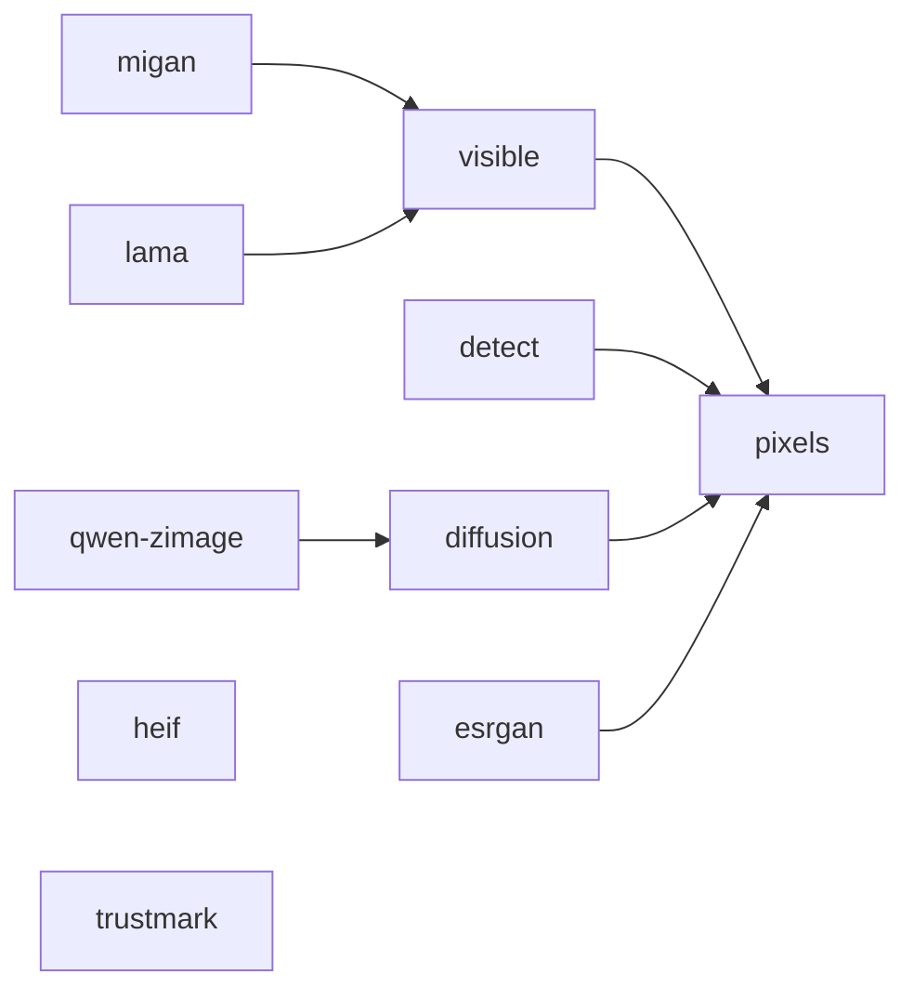

# Installation

Python 3.10.1 or newer is required.

## Default metadata mode

The default package provides:

- provenance inspection;
- AI metadata inspection and removal.

It installs Pillow, piexif, and c2pa-python for reading metadata directly from
files. It does not install NumPy, OpenCV, pillow-heif, Torch, diffusion models,
or invisible-watermark decoders.

Install it as an isolated command with uv:

```bash
uv tool install remove-ai-watermarks
```

Or with pipx:

```bash
pipx install remove-ai-watermarks
```

You can also install the Homebrew package on macOS or Linux:

```bash
brew install wiltodelta/tap/remove-ai-watermarks
```

## Visible watermark removal

Visible mark detection, OpenCV inpainting, and manual region erasing need the
`visible` extra:

```bash
uv tool install --force "remove-ai-watermarks[visible]"
```

Add `heif` only when the pixel path must decode HEIC, HEIF, or AVIF:

```bash
uv tool install --force "remove-ai-watermarks[visible,heif]"
```

## Invisible watermark removal

Diffusion based removal needs the `diffusion` extra:

```bash
uv tool install --force "remove-ai-watermarks[diffusion]"
```

The code supports CUDA, XPU, MPS, and CPU devices. A GPU is recommended because
CPU inference is slow.

For the CUDA only Qwen Image plus Z-Image profile:

```bash
uv tool install --force "remove-ai-watermarks[qwen-zimage]"
```

The `qwen-zimage` extra includes the normal `diffusion` dependencies.

## Feature extras

Extras are composable. Install only the capabilities and file formats the
application actually uses:

| Extra | Capability | Automatically includes | Torch or model download |
| --- | --- | --- | --- |
| `pixels` | Shared BGR array and image-processing runtime | NumPy, headless OpenCV | No |
| `heif` | HEIC, HEIF, and AVIF pixel decoding | pillow-heif | No |
| `visible` | Visible mark detection, OpenCV inpainting, and manual erasing | `pixels` | No |
| `detect` | Open DWT-DCT detection for Stable Diffusion, SDXL, and FLUX | `pixels`, PyWavelets | No |
| `trustmark` | Adobe TrustMark detection | trustmark | Yes |
| `diffusion` | Diffusion-based invisible watermark removal | `pixels`, Torch, Diffusers | Yes |
| `migan` | MI-GAN ONNX fill backend | `visible`, ONNX Runtime | Model download, no Torch |
| `lama` | big-LaMa ONNX fill backend | `visible`, ONNX Runtime | Model download, no Torch |
| `esrgan` | Real-ESRGAN upscaling before diffusion | `pixels`, spandrel | Yes |
| `qwen-zimage` | CUDA-only Qwen Image plus Z-Image pipeline | `diffusion`, DiffSynth | Yes |
| `all` | Every production feature | All rows above | Yes |
| `dev` | Tests, linting, typing, and upstream parity checks | `visible`, `detect`, upstream invisible-watermark | Yes, for parity tests |

Dependency composition:



`heif` and `trustmark` are independent branches. Combine them explicitly with
another feature when required. The `all` bundle contains every production
branch but never includes `dev`.

Examples:

```bash
# Metadata plus torch-free DWT-DCT detection
uv tool install --force "remove-ai-watermarks[detect]"

# Visible removal with HEIC/AVIF support and MI-GAN
uv tool install --force "remove-ai-watermarks[migan,heif]"

# DWT-DCT and TrustMark detection without diffusion removal
uv tool install --force "remove-ai-watermarks[detect,trustmark]"

# Every production capability
uv tool install --force "remove-ai-watermarks[all]"

# An arbitrary minimal combination
uv tool install --force "remove-ai-watermarks[migan,detect]"
```

`heif` stays independent so applications that only process PNG, JPEG, or WebP
do not install libheif. `detect` uses the in-tree torch-free decoder and does
not install the upstream `invisible-watermark` package. Optional models download
their weights on first use.

The old `gpu` and `remove` aliases are intentionally not provided. Use
`diffusion` and `visible` respectively.

## Install from the repository

```bash
git clone https://github.com/wiltodelta/remove-ai-watermarks.git
cd remove-ai-watermarks
uv sync --frozen
```

Add the feature groups required for your work:

```bash
uv sync --frozen --extra dev
uv sync --frozen --extra dev --extra diffusion
```

Run commands from the repository root:

```bash
uv run remove-ai-watermarks --help
```

## Development setup

Install development dependencies:

```bash
uv sync --frozen --extra dev
```

Run the complete project gate:

```bash
bash maintain.sh
```

The script runs dependency checks, linting, formatting checks, type checking,
and the test suite.

## Hugging Face authentication

Pass a Hugging Face token directly when the selected model or account requires
one:

```bash
remove-ai-watermarks invisible image.png --hf-token "$HF_TOKEN"
```

The CLI also loads `HF_TOKEN` from the environment and from a local `.env`
file. The same name is documented in `.env.example`.

## Troubleshooting

### The first model run is slow

Diffusion and learned fill backends may download model weights on first use.
Later runs reuse their caches.

### The command skips invisible removal

The normal behavior is to skip diffusion when no supported local signal is
found. A missing signal does not prove that the image is clean. If you know the
image came from a relevant generator, use `--force`.

If the CLI reports that diffusion dependencies are unavailable, install the
`gpu` extra.
