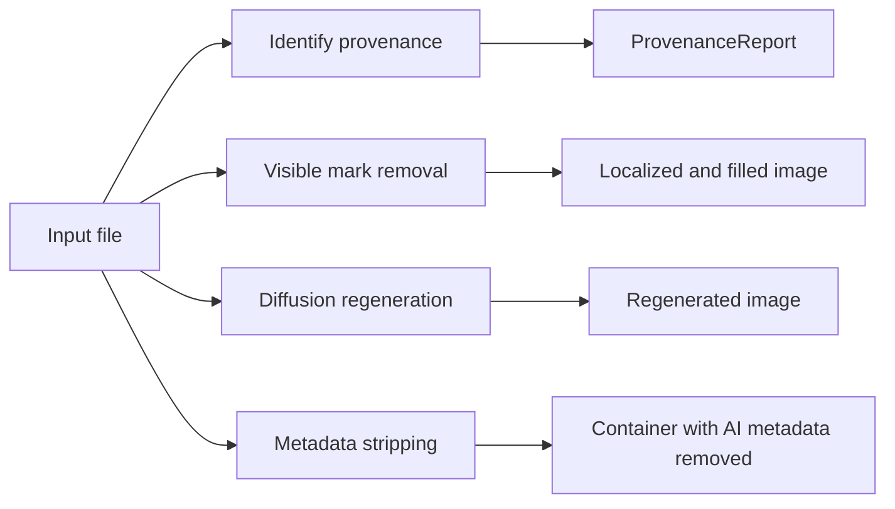

# Module internals

This page documents the current implementation contract. It intentionally
avoids experiment logs, corpus counts, and calibration history. Those records
live in [the verification plan](verification-plan.md) and the research archive
listed in [the documentation index](index.md).

Read the relevant section before changing a subsystem. When this page and the
code disagree, the code and its tests are authoritative and this page must be
updated in the same change.

## Architecture

The package has four main paths:

The `all` command runs visible removal, optional invisible regeneration, and
metadata stripping in that order.

## Command line interface

[`cli.py`](../src/remove_ai_watermarks/cli.py) owns command parsing and
user-facing exit behavior.

Important contracts:

- Single-image arguments reject directories.
- `visible` writes no output when no registered mark is selected and exits with
  `EXIT_NO_VISIBLE_MARK`.
- `invisible` writes no output when no supported local signal is found, unless
  `--force` is supplied.
- The two no-signal conditions currently share exit code `2`.
- Hard processing and write failures exit with code `1`.
- `all` can still write the completed visible and metadata stages when the
  diffusion dependencies are unavailable, but exits with code `1` so the
  partial result is not reported as complete.
- `batch` counts per-file failures and exits nonzero if any file failed or an
  applicable invisible stage was skipped because its dependencies were absent.

The decorators for diffusion options are shared by `invisible`, `all`, and
`batch`. The runtime help generated by Click is the source of truth for option
names and defaults.

The deprecated `--auto` option does not select a pipeline or change adaptive
polishing. [`_resolve_auto_polish`](../src/remove_ai_watermarks/cli.py) emits a
warning and returns the explicit polish value unchanged.

Regression coverage:

- [`test_cli.py`](../tests/test_cli.py)
- [`test_cli_robustness.py`](../tests/test_cli_robustness.py)
- [`test_optional_deps.py`](../tests/test_optional_deps.py)

## High-level Python API

[`api.py`](../src/remove_ai_watermarks/api.py) provides:

- `remove_visible`
- `visible_provenance`

The package root exposes both lazily through
[`__getattr__`](../src/remove_ai_watermarks/__init__.py), keeping a plain package
import free of the heavier image and model imports.

For path inputs, `remove_visible` reads provenance metadata, preserves alpha,
and optionally writes and strips metadata. Array inputs are treated as BGR
arrays and have no file provenance or separate alpha plane.

When no visible mark is removed, a same-format path copy preserves the original
bytes. `write_noop=False` leaves the requested output path untouched instead.

Regression coverage:

- [`test_api.py`](../tests/test_api.py)
- [`test_image_io.py`](../tests/test_image_io.py)

[`video.py`](../src/remove_ai_watermarks/video.py) provides the experimental
video entry point:

- `inspect_video_metadata`
- `remove_video_metadata`
- `remove_video_visible`

The video API validates both the supported extension and container signature,
then delegates all metadata detection and stripping to `metadata.py`. It
requires a separate same-container output, defaulting to `<source>_clean`, so
the experimental path does not overwrite an original. The package root exposes
both functions lazily.

Native MP4/MOV TC260 labels follow TC260-PG-20257A:
`moov.udta.meta.keys` maps an `AIGC` key to a raw JSON value in `ilst`.
[`noai/isobmff.py`](../src/remove_ai_watermarks/noai/isobmff.py) walks those
nested boxes by seeking, so detection reaches a tail `moov` without reading the
preceding `mdat`. Removal changes the four-byte key to `free` and blanks only
the validated JSON value with same-length spaces. This preserves every box
size, `stco`/`co64` offset, and encoded stream byte. A generic `AIGC` key whose
value has no TC260 field is ignored.

[`noai/ebml.py`](../src/remove_ai_watermarks/noai/ebml.py) provides the
corresponding bounded Matroska/WebM reader. It seeks over clusters and accepts
only a `Segment.Tags.Tag.SimpleTag` pairing `TagName=AIGC` with a JSON
`TagString` carrying a TC260 field. The existing ffmpeg stream-copy path removes
those container tags without transcoding the encoded streams.

[`video_visible.py`](../src/remove_ai_watermarks/video_visible.py) implements
the first pixel stages for Sora and Veo. The Sora detector searches a normalized
frame with a fully synthetic mascot-and-text silhouette at several scales. The
Veo detector uses separate synthetic silhouettes for the current four-point
diamond and legacy `Veo` text, with bounded bottom-right searches calibrated
independently from Sora. A strong relocated-diamond match may bypass the known
layout anchors, but weak free-corner matches never enter the temporal arbiter.
This prevents recurring scene details in clean API exports from being promoted
to a watermark.

Every per-frame result is untrusted. The provider-specific stabilization
wrappers share one recurrence implementation, while retaining separate visual
floors and minimum-run policy. Provenance can relax a low-contrast run only
after recurring visual evidence exists. Sora transition frames follow the
nearest confirmed moving position only with Sora provenance. A confirmed Veo
run can cover low-contrast frames at its fixed position. This separation keeps
clean API exports from being modified merely because metadata names the same
generator.

Removal runs in a second decode pass. Sora and legacy Veo text use padded box
masks. The square Veo diamond uses a synthetic shape mask so transparent box
corners do not erase unrelated pixels. Every mask goes through the shared
`watermark_registry.fill` backends. ffmpeg encodes the changed video stream and
copies optional audio. The default OpenCV fill is the speed floor; structured
backgrounds need MI-GAN or LaMa for better reconstruction. Invisible video
stages must continue to reuse the image and metadata implementations rather
than copying their logic.

The inherited ISOBMFF metadata path currently reads the complete container into
memory; replacing that with a streaming box copier is a prerequisite for large
video inputs.

Regression coverage:

- [`test_video.py`](../tests/test_video.py)

## Metadata and provenance

### C2PA

[`noai/c2pa.py`](../src/remove_ai_watermarks/noai/c2pa.py) reads C2PA with the
official `c2pa-python` reader first. Its byte-level PNG parser remains a fallback
for partial and synthetic fixtures that the official reader rejects.

Vendor attribution comes from the registry in
[`noai/constants.py`](../src/remove_ai_watermarks/noai/constants.py). Derived
issuer and platform maps should not be maintained separately.

### Metadata scanning and stripping

[`metadata.py`](../src/remove_ai_watermarks/metadata.py) contains the shared
metadata scanners and `remove_ai_metadata`.

Key contracts:

- `scan_head` is the shared cached input for bounded byte scans.
- JPEG stripping walks metadata segments and preserves the entropy-coded image
  scan.
- ISOBMFF containers use
  [`noai/isobmff.py`](../src/remove_ai_watermarks/noai/isobmff.py).
- Native MP4/MOV TC260 `AIGC` entries are read from
  `moov.udta.meta.keys/ilst` and blanked without changing box sizes.
- Native MKV/WebM TC260 `AIGC` entries are read from
  `Segment.Tags.Tag.SimpleTag` and removed through the ffmpeg stream-copy path.
- Supported non-ISOBMFF audio and video containers use ffmpeg stream copying.
- The low-level remover is fail-safe and can copy an undecodable file through
  unchanged.
- A caller that reports success must use `strip_and_verify`, which scans the
  written output for surviving markers. If the metadata-preserving decoder
  rejected the container but `image_io` can still decode its raster,
  `strip_and_verify` normalizes that raster and scans again. A truly undecodable
  file keeps the surviving-marker result.

Detection and removal must stay in parity. A new marker is incomplete until the
scanner can find it, the remover can reach every supported placement, and a
test proves that it no longer appears in the output.

Regression coverage:

- [`test_metadata.py`](../tests/test_metadata.py)
- [`test_noai.py`](../tests/test_noai.py)
- [`test_security_clamp.py`](../tests/test_security_clamp.py)

### Provenance report

[`identify.py`](../src/remove_ai_watermarks/identify.py) combines metadata,
registered visible marks, and optional open invisible-watermark decoders into a
`ProvenanceReport`.

`is_ai_generated` is `True` or `None`; absence of evidence is not reported as a
human-made verdict. `ai_source_kind` distinguishes fully generated content from
AI-enhanced composites when the source metadata provides that distinction.

TrustMark is reported as a watermark signal but does not by itself assert AI
origin because it can also protect human-authored content.

Regression coverage:

- [`test_identify.py`](../tests/test_identify.py)
- [`test_trustmark_detector.py`](../tests/test_trustmark_detector.py)
- [`test_invisible_watermark.py`](../tests/test_invisible_watermark.py)

## Visible mark removal

### Registry and decision flow

[`watermark_registry.py`](../src/remove_ai_watermarks/watermark_registry.py) is
the only visible-mark registry. `mark_keys()` supplies the CLI choices, so the
CLI must not maintain a separate mark list.

Automatic removal has three distinct stages:

1. Perception: each registered detector produces strict and relaxed candidates.
2. Decision: the pure `decide` arbiter applies sensitivity and corroborating
   provenance.
3. Action: each selected mark is localized to a mask and passed to the shared
   fill function.

`sensitivity="strict"` never relaxes a detector. `sensitivity="auto"` can relax
one only when metadata or a sufficiently strong same-product sibling confirms
that product. The removed blanket `assume_ai` mode is rejected explicitly.

The Jimeng pill has an additional decision gate because its visual detector is
weaker than the other registered marks. Keep that policy in the registry, not
inside unrelated detector engines.

`remove_auto_marks` removes every selected mark, not only the strongest one.
This matters for images that carry marks in more than one corner.

Regression coverage:

- [`test_watermark_registry.py`](../tests/test_watermark_registry.py)
- [`test_api.py`](../tests/test_api.py)

### Gemini sparkle

[`gemini_engine.py`](../src/remove_ai_watermarks/gemini_engine.py) uses a
multi-scale shape search and a false-positive gate. Its captured sparkle assets
serve detection and mask geometry only. Pixel recovery is performed by the
shared fill backend.

`detect_sparkle_confidence` uses a process-wide shared engine because its loaded
assets and template ladder are immutable.

Regression coverage:

- [`test_gemini_engine.py`](../tests/test_gemini_engine.py)

### Text mark engines

[`_text_mark_engine.py`](../src/remove_ai_watermarks/_text_mark_engine.py)
provides common localization, detection front ends, template caching, rival
comparison, and footprint construction.

Each vendor module supplies a `TextMarkConfig` and only the behavior that cannot
be represented by the shared base:

- [`doubao_engine.py`](../src/remove_ai_watermarks/doubao_engine.py)
- [`jimeng_engine.py`](../src/remove_ai_watermarks/jimeng_engine.py)
- [`qwen_engine.py`](../src/remove_ai_watermarks/qwen_engine.py)
- [`kling_engine.py`](../src/remove_ai_watermarks/kling_engine.py)
- [`yuanbao_engine.py`](../src/remove_ai_watermarks/yuanbao_engine.py)
- [`samsung_engine.py`](../src/remove_ai_watermarks/samsung_engine.py)
- [`runninghub_engine.py`](../src/remove_ai_watermarks/runninghub_engine.py)
- [`baidu_engine.py`](../src/remove_ai_watermarks/baidu_engine.py)
- [`liblib_engine.py`](../src/remove_ai_watermarks/liblib_engine.py)

The detector and removal mask must use compatible geometry. A detector that
fires while producing an empty or misplaced mask is a removal failure even if
the detection test passes.

Yuanbao uses the polarity-independent `contrast` front end because its standard
two-line mark can be light on dark scenes or dark on light scenes. Its detector
and footprint both use the same best-match box. The separate one-line overlay
variant is not covered.

The capture-less Jimeng pill lives in
[`pill_engine.py`](../src/remove_ai_watermarks/pill_engine.py). It uses a
synthetic silhouette for detection and a fixed top-left footprint.

Each engine has a corresponding test module under [`tests/`](../tests/).
Shared behavior is covered by:

- [`test_text_mark_engine.py`](../tests/test_text_mark_engine.py)
- [`test_text_mark_faint_mask.py`](../tests/test_text_mark_faint_mask.py)
- [`test_text_mark_memory.py`](../tests/test_text_mark_memory.py)

### Fill backends and region erasing

[`region_eraser.py`](../src/remove_ai_watermarks/region_eraser.py) implements the
same backends used by visible removal and the user-directed `erase` command:

- `cv2`
- `migan`
- `lama`

`watermark_registry.resolve_backend` selects LaMa first, then MI-GAN, then
OpenCV for `auto`. A memory-constrained caller should explicitly select MI-GAN
or OpenCV instead of relying on `auto`.

MI-GAN and LaMa crop around the mask before model inference and paste back only
masked pixels. Their model sessions are loaded lazily. MI-GAN uses the inverse
mask polarity expected by its ONNX model.

Regression coverage:

- [`test_region_eraser.py`](../tests/test_region_eraser.py)
- [`test_inpaint_fallback.py`](../tests/test_inpaint_fallback.py)

## Invisible watermark regeneration

### Profiles and strength

[`noai/watermark_profiles.py`](../src/remove_ai_watermarks/noai/watermark_profiles.py)
is the source of truth for:

- profile aliases;
- default model identifiers;
- default steps and seeds;
- vendor-adaptive strength resolution;
- the minimum viable step calculation.

The current profiles are `controlnet`, `sdxl`, `qwen`, and `qwen-zimage`.
For serverless cold starts, `InvisibleEngine.preload(global_only=True)` loads the
mandatory Qwen stage and YuNet while leaving the optional Z-Image and SAM face
stack lazy until a face is detected. The default `preload()` still loads every
stage.
`default` is a legacy alias for `sdxl`. There is no content-dependent automatic
router.

[`invisible_engine.py`](../src/remove_ai_watermarks/invisible_engine.py) handles
image sizing, optional pre-upscaling, postprocessing, and the public engine
interface. It delegates model execution to
[`noai/watermark_remover.py`](../src/remove_ai_watermarks/noai/watermark_remover.py).

The Python engine and CLI do not have identical defaults for every optional
postprocessing argument. Integrations that require reproducibility should pass
the relevant values explicitly.

Regression coverage:

- [`test_watermark_profiles.py`](../tests/test_watermark_profiles.py)
- [`test_invisible_engine.py`](../tests/test_invisible_engine.py)
- [`test_img2img_runner.py`](../tests/test_img2img_runner.py)
- [`test_platform.py`](../tests/test_platform.py)

### CPU offload

CPU offload is enabled only when requested on CUDA. The standard Diffusers
profiles call `enable_model_cpu_offload`. The `qwen-zimage` profile uses the
same flag to force its face stack out of automatic device residency.

Regression coverage:

- [`test_cpu_offload.py`](../tests/test_cpu_offload.py)

### Qwen plus Z-Image

[`noai/qwen_zimage_pipeline.py`](../src/remove_ai_watermarks/noai/qwen_zimage_pipeline.py)
implements the fixed CUDA-only two-stage profile:

1. Qwen Image with Canny conditioning regenerates the frame.
2. YuNet locates faces, SAM builds masks, and Z-Image regenerates the selected
   face regions.

The profile rejects a custom model identifier. Its global and face model stack
is fixed by the implementation. When tiling is enabled, only the global stage
is tiled; the face stage runs once after the tiles are blended.

The resolution and largest-face adaptive formulas remain exact ports of the
reference workflow. The face stage applies half the reference result because
this port uses a different sampler and composites regenerated SAM pixels rather
than using the reference latent inpaint mask and noise feather. Paired face
evaluations favored this scale on identity, perceptual distance, and full-image
similarity, and the exact OpenAI and Gemini candidates both passed their
matching provider oracle. The global stage stays unchanged.

Regression coverage:

- [`test_qwen_zimage_pipeline.py`](../tests/test_qwen_zimage_pipeline.py)
- [`test_cpu_offload.py`](../tests/test_cpu_offload.py)

### Tiling

[`noai/tiling.py`](../src/remove_ai_watermarks/noai/tiling.py) contains pure
tile planning, feather weights, tile orchestration, and region compositing.

Tiling engages only when requested and the long side exceeds the tile size.
It avoids an explicit full-image downscale but does not make diffusion
pixel-preserving. Each tile is still regenerated.

`feather_region_composite` changes only the requested box and leaves pixels
outside it unchanged.

Regression coverage:

- [`test_tiling.py`](../tests/test_tiling.py)

### Upscaling and postprocessing

[`upscaler.py`](../src/remove_ai_watermarks/upscaler.py) is the optional
Real-ESRGAN path used only when enlarging a small image to the minimum
resolution floor. Failure or an absent extra falls back to Lanczos.

[`humanizer.py`](../src/remove_ai_watermarks/humanizer.py) contains explicit
grain, unsharp masking, and adaptive polish helpers.

Regression coverage:

- [`test_upscaler.py`](../tests/test_upscaler.py)
- [`test_humanizer.py`](../tests/test_humanizer.py)

## Image input and output

[`image_io.py`](../src/remove_ai_watermarks/image_io.py) is the shared image
codec boundary.

Contracts:

- All package OpenCV file reads and writes use `image_io.imread` and
  `image_io.imwrite`.
- `to_bgr` normalizes grayscale and alpha-bearing arrays.
- `read_bgr_and_alpha` and `write_bgr_with_alpha` preserve the alpha plane.
- `imwrite` returns a success flag; every caller must check it.
- HEIC, HEIF, and AVIF fall back to Pillow plus `pillow-heif`.
- A visible no-op can preserve the original file bytes.

Regression coverage:

- [`test_image_io.py`](../tests/test_image_io.py)
- [`test_cli_robustness.py`](../tests/test_cli_robustness.py)

## Adding or changing behavior

For a new visible mark:

1. create a synthetic detection silhouette;
2. add or extend a vendor engine;
3. add one registry entry;
4. test detection, false positives, localization, and actual pixel change;
5. update [supported signals](supported-signals.md).

For a new metadata signal:

1. add the scanner;
2. add every supported removal placement;
3. verify the output through `strip_and_verify`;
4. add identification and removal tests;
5. update [supported signals](supported-signals.md) and, when relevant,
   [the watermarking landscape](watermarking-landscape.md).

For a diffusion change:

1. keep model-free logic in pure helpers where possible;
2. test option propagation and dispatch without downloading models;
3. run a real model smoke for the changed model path;
4. treat provider-verifier results as specific to the exact checked output;
5. update [known limitations](known-limitations.md).
